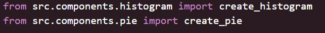
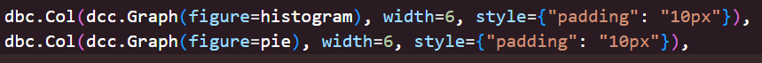

# Data-Project
## Driss DRIYEJ - Mathieu PROAL

## USER GUIDE
Voici les différentes étapes à suivre pour pouvoir éxécuter le programme sur votre poste. Ces différentes étapes sont des commandes à entrer dans le terminal de votre machine ;
- Clonez le projet en local :
`git clone git@github.com:MathieuProal/DataProject.git`
- Déplacez-vous dans le répertoire du projet :
`cd DataProject`
- Installez toutes les dépendances nécessaires pour l'éxécution du programme :
`python -m pip install -r requirements.txt`
- Lancez l'éxécution :
`python main.py`

## DATA
#### Jeu de donnée utilisé : **Vélib - Vélos et bornes - Disponibilité temps réel**
Ce jeu de données, mis en ligne par la ville de Paris, renseigne les bornes de vélib, vélos mécaniques et électriques des stations Vélib'Métropole.\
*https://opendata.paris.fr/explore/dataset/velib-disponibilite-en-temps-reel/table/?disjunctive.name&disjunctive.is_installed&disjunctive.is_renting&disjunctive.is_returning&disjunctive.nom_arrondissement_communes*

## DEVELOPER GUIDE
### Organisation du code
Le code est organisé par dossiers, tous les fichiers python étant dans le dossier [src](src/) à la racine du dépot.\
Vous trouverez dans ce dossier :
- Les différents composants du dahsboard dans le dossier [components](src/components/)
- Les pages du dashborad dans le dossier [pages](src/pages/)
- Les fichiers permettant des récupérer et de nettoyer les données dans [utils](src/utils/)

### Ajouter une page ou un graphique
Pour ajouter un élément dans une page, il faut créer le fichier contenant le composant dans le dossier [components](src\components), puis l'ajouter à la page que l'on souhaite, dans le fichier de la page en question./
Par exemple, pour ajouter un autre graphe à la première page, après avoir ajouté le fichier du composant dans le dossier [components](src/components/), vous devez l'importer dans le fichier [dashboard_histogram](src\pages\dashboard_histogram.py) (voir photo 1), puis utiliser le composant dans la page (voir photo 2). Vous pouvez utiliser les mêmes paramètres de style, vous n'avez qu'à changer le nom du composant pour utiliser le vôtre.\
\

## RAPPORT D'ANALYSE
Grâce à ces données, on peut voir qu'il y a énormément de bornes de vélib à disposition des utilisatuers, et plus particulièrement dans la ville de Paris.\
Une fois sortis de la capitale, celles-ci se font plus de plus en plus rares, et ne vont pas plus loin que la petite couronne, c'est à dire les villes les plus proches de Paris.\
On peut en conclure que les services de vélib sont prévus pour une utilisation quasi-exclusive à Paris, probablement car placer des stations plus loin ne serait pas rentable pour l'entreprise.

## COPYRIGHT
Nous, sous signé Driss DRIYEJ et Mathieu PROAL, déclarons sur l'honneur que les lignes de code de ce projet ont été produites par nous-mêmes
